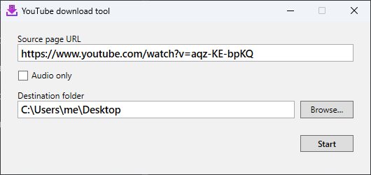
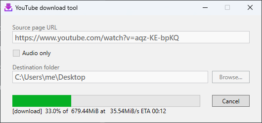

#  YouTube download tool

A small Windows app for saving videos (or just their audio) from the web. Copy a URL, open the app, and click Start!

Despite the name, it works with an extremely wide variety of video-hosting sites: Vimeo, Dailymotion, Twitch, SoundCloud, Bandcamp, news sites, and well over a thousand more. If [yt-dlp supports it](https://github.com/yt-dlp/yt-dlp/blob/master/supportedsites.md), this app does too.

## Download

Get `YouTubeDownloadTool.exe` from the [latest release](https://github.com/jnm2/YouTubeDownloadTool/releases/latest). No installation is needed.

The app requires the [.NET 10 Desktop Runtime](https://aka.ms/dotnet/10.0/windowsdesktop-runtime-win-x64.exe) or newer, and will prompt you to install it the first time if it's missing.

## How to use

1. Paste the address of the page containing the video into **Source page URL**.
2. Check **Audio only** if you just want the sound.
3. Choose a **Destination folder** and click **Start**.

Progress is shown in the window and on the app's taskbar icon. The URL box clears when the download is done, and the destination folder and audio setting will be remembered for next time.

## Always up to date

Video sites change constantly, so the app keeps its download tools fresh on its own. Each time it starts, it checks for and fetches the latest releases of:

- [**yt-dlp**](https://github.com/yt-dlp/yt-dlp), which does the downloading, from its [GitHub releases](https://github.com/yt-dlp/yt-dlp/releases)
- [**FFmpeg**](https://ffmpeg.org), which merges and converts audio and video, from [gyan.dev's Windows builds](https://www.gyan.dev/ffmpeg/builds/)

Updates happen in the background and old versions are cleaned up automatically. There's nothing to configure and no need to update the app itself to pick up fixes for a site.
