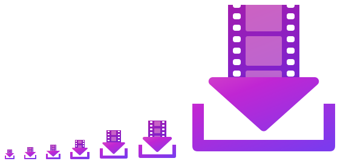

# App icon



`generate.mjs` is the source of the app icon. It writes one SVG per size (16, 20, 24, 32, 48, 64, 256) to `out/`, renders them to PNG, and packs them into [`src/YouTubeDownloadTool/AppIcon.ico`](../../src/YouTubeDownloadTool/AppIcon.ico). Every size is also rendered side by side to `sizes.png` for this README, and the 32 px form is written to [`assets/readme/icon.svg`](../readme/icon.svg) for the [repository README](../../README.md)'s heading, sized so the tray sits on the text baseline and the top of the arrowhead meets the cap height.

## Regenerating

Requires [Node.js](https://nodejs.org), [Inkscape](https://inkscape.org) and [ImageMagick](https://imagemagick.org). They are found in their default install locations, on `PATH`, or via the `INKSCAPE` and `MAGICK` environment variables.

```
node assets/icon/generate.mjs
```

Check `assets/icon/out/preview.png` (every size enlarged), then commit the updated `AppIcon.ico`, `sizes.png`, `assets/readme/icon.svg` and `generate.mjs`.

## Adjusting

Following the [Windows app icon guidelines](https://learn.microsoft.com/windows/apps/design/style/iconography/app-icon-design), each size is tuned separately rather than scaled:

- **Colors**: `BODY`, `STRIP`, `FRAME_FILL`/`FRAME_OPACITY`.
- **16, 20, 24** (title bar at 100/125/150% scaling): exact pixel coordinates in `PIXEL_TIERS`.
- **32 and up**: proportions blend from `AT16` to `AT256` as size increases. Use `PX_OVERRIDE` for one-off pixel fixes at a single size and `HEAD_R` for arrowhead corner rounding.
